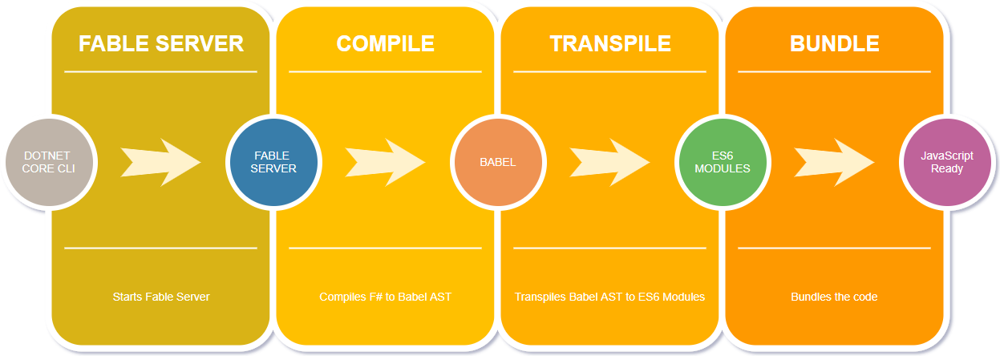

# Mise en place de l'environnement de développement


> **Objectif**: nous allons installer et mettre en place pas à pas l'environnement de compilation pour `Fable` en partant d'un répertoire vide pour mieux comprendre le fonctionnement.

## Conditions préalables

- **node** - Nécessaire pour exécuter le code JavaScript
- **yarn** - Utilisé pour les dépendances du côté JavaScript
- **.NET Core SDK** - Utilisé pour la gestion de projet
- **La famille de plugins Ionide et VS Code**  - Non requis, mais fortement recommandé pour améliorer l'expérience des développeurs.


## Fonctionnement 



Le schéma ci-dessus représente l'orchestration des différentes tâches utilisées par Fable.

1. Via la CLI dotnet on va exécuter la commande Fable
2. Un serveur de compilation Fable démarre et écoute les changements sur les sources F# pour compiler le projet et en extraire un arbre de syntaxe abstraite (AST).
- 3. Babel prend cette AST en entré et le transpile en module ES6.
- 4. Pour finir webpack va "bundler" l'ensemble des modules en un fichier pour node ou pour le browser. 


> 💬 Par défaut le serveur fable utilise le port 61225 pour communiquer.


## Structure des répertoires

Commencez par créer un nouveau répertoire pour le projet :
Dans ce répertoire créez un dossier vide appelé .paket qui va contenir le gestionnaire de paquets nuget Paket.

```powershell
mkdir fable-from-scratch
cd fable-from-scratch
mkdir ./.paket
```
## Création du projet F#

Nous allons créer une nouvelle application F# de type console en utilisant la CLI de dotnet : 

```powersell
dotnet new console -lang f#
```

Testez la compilation et le bon fonctionnement :
```powersell
dotnet restore
dotnet run
```


### Paket

Paket est indispensable à l'heure actuelle pour le bon fonctionnement de Fable.
C'est un gestionnaire de paquets alternatif à nuget qui apporte un grand nombre de fonctionnalités comme l'utilisation d'un fichier `paket.lock` pour garantir une restauration des mêmes versions des dépendances pour l'ensemble des développeurs.

Par convention, les binaires de Paket sont installés dans le répertoire .paket que nous avons créé ci-dessus.

Téléchargez le fichier [paket.bootstrapper.exe](
https://github.com/fsprojects/Paket/releases/download/5.148.0/paket.bootstrapper.exe)
, puis renommez-le en paket.exe et copiez-le dans le dossier .paket. Cela active le "mode magique" qui permet de mettre à jour automatiquement paket sans commande supplémentaire.

> Sous windows, il est nécessaire de débloquer l'exécution de l'application : clic droit -> propriétés -> débloquer

> Sous linux/mac paket se lance avec mono :  `mono ./.paket/paket.exe`

Nous allons basculer la restauration des paquets depuis Nuget vers Paket. 
Paket dispose d'une commande de migration :

```
./.paket/paket.exe convert-from-nuget
```

Après l'éxécution vous allez obtenir les fichiers et répertoire suivant :

- 📁 **packages**: Ce dossier va contenir toutes les dépendances que vous téléchargez via paket.
- 📄 **paket.references**: Ce fichier se trouve à la racine de votre projet. Il contient les références utilisées par le projet.
- 📄 **paket.dependencies**: Ce fichier est placé à la racine de la solution et définie la liste de vos dépendances **directes**. 

Les fichiers paket sont facilement éditables à la main ou en utilisant les commandes de paket : `paket add` et `paket remove`.

Ajoutons maintenant les dépendances de fable.
Utilisez paket pour rechercher les paquets dont le nom contient "Fable" :


```powershell
./.paket/paket.exe find-packages Fable

Paket version 5.148.0
Fable.React
Fable.Core
Fable.React.Native
Fable.FCS
Fable.Ava
Fable.Sinon
Fable.Mqtt
Fable.Import.Mocha
Fable.Inferno
Fable.Chessie
Fable.Import.Pixi
dotnet-fable
Fable.Compiler
Fable.PowerPack
Fable.Import.Browser
Fable.JsonConverter
Fable.Elmish
Fable.Elmish.React
Fable.Import.Node
Fable.Template
Performance:
 - Average Request Time: 1 second
 - Number of Requests: 3
 - Runtime: 5 seconds
```

Nous allons ajouter `Fable.Core`et `Fable.Import.Browser` à notre projet.

```
./.paket/paket.exe add Fable.Core --project ./fable-from-scratch.fsproj
./.paket/paket.exe add Fable.Import.Browser --project ./fable-from-scratch.fsproj

./.paket/paket.exe install
```

Les deux dépendances ont été ajoutées dans les fichiers paket et la commande `paket install` a déclenchée le téléchargement et a également ajoutée une cible de restauration au fichier .fsproj. Cela vous permet de restaurer les dépendances de paquets en effectuant simplement une restauration dotnet (`dotnet restore`).

```xml
  <Import Project=".paket\Paket.Restore.targets" />
```


> 💬  Il est possible de mettre à jour les paquets en utilisant > les commandes suivantes: 
> `./.paket/paket.exe outdated` et `./.paket.exe update`


## Fable CLI

Nous allons maintenant installer une extension à la CLI dotnet qui est paquagé sous forme de nuget.

Ajoutez une référence de type DotNetCliToolReference dans le fichier de projet `fable-from-scratch.fsproj`


```xml
<?xml version="1.0" encoding="utf-8"?>
<Project Sdk="Microsoft.NET.Sdk">
  <PropertyGroup>
    <OutputType>Exe</OutputType>
    <TargetFramework>netcoreapp2.0</TargetFramework>
  </PropertyGroup>
  <ItemGroup>
    <Compile Include="Program.fs" />
    <DotNetCliToolReference Include="dotnet-fable" Version="1.3.*" />
  </ItemGroup>
  <Import Project=".paket\Paket.Restore.targets" />
</Project>
```

Il ne reste plus qu'à lancer une restauration :
```
dotnet restore
```

Fable est maintenant installé !!🙌
Testez en exécutant la commande suivante :

```
dotnet fable --help

Fable F# to JS compiler (1.3.10)
Usage: dotnet fable [command] [script] [fable arguments] [-- [script arguments]]

Commands:
  -h|--help           Show help
  --version           Print version
  start               Start Fable daemon
  npm-run             Run Fable while an npm script is running
  yarn-run            Run Fable while a yarn script is running
  node-run            Run Fable while a node script is running
  shell-run           Run Fable while a shell script is running
  webpack             Start Fable daemon, invoke Webpack and shut it down
  webpack-dev-server  Run Fable while Webpack development server is running

Fable arguments:
  --timeout           Stop the daemon if timeout (ms) is reached
  --port              Port number (default 61225) or "free" to choose a free port
  --verbose           Print more info during execution

To pass arguments to the script, write them after `--`. Example:

    dotnet fable npm-run build --port free -- -p --config webpack.production.js

You can use shortcuts for npm and yarn scripts in the following way:

    dotnet fable yarn-start       # Same as `dotnet fable yarn-run start`
```


## Mise en place de l'environnement JS

La partie dotnet est en place, il faut maintenant installer l'environnement javascript/node.

Dans cet atelier nous allons utiliser trois briques JavaScript :

- Babel
- Webpack
- Fable-Loader

Il est possible d'utiliser une autre brique pour créer le bundle js, comme `rollup` ou `parcel`, mais webpack est pour l'instant plus mature et plus stable.

De plus `yarn` va être utilisé à la place de npm, pour des questions d'efficacité.

Initiez le fichier package.json et ajoutez les dépendances pour babel, webpack et fable


```
yarn init -y
yarn add -D babel-runtime babel-core babel-loader babel-plugin-transform-runtime babel-preset-es2015 babel-preset-env fable-loader webpack webpack-cli webpack-dev-server
```


## configuration du bundler (webpack)

Webpack nécessite un fichier de configuration `webpack.config.js`.

```
echo $null >> webpack.config.js
```

Copiez ce contenu dans le fichier 

```js
var path = require("path");
var webpack = require("webpack");
var fableUtils = require("fable-utils");

function resolve(filePath) {
  return path.join(__dirname, filePath)
}

var babelOptions = fableUtils.resolveBabelOptions({
  presets: [
    ["env", {
      "targets": {
        "browsers": "> 1%"
      },
      "modules": false
    }]
  ],
});

var isProduction = process.argv.indexOf("-p") >= 0;
console.log("Bundling for " + (isProduction ? "production" : "development") + "...");

module.exports = {
  devtool: "source-map",
  entry: resolve('./fable-from-scratch.fsproj'),
  output: {
    filename: 'bundle.js',
    path: resolve('./public'),
  },
  resolve: {
    modules: [resolve("./node_modules/")]
  },
  devServer: {
    contentBase: resolve('./public'),
    port: 8080
  },
  module: {
    rules: [
      {
        test: /\.fs(x|proj)?$/,
        use: {
          loader: "fable-loader",
          options: {
            babel: babelOptions,
            define: isProduction ? [] : ["DEBUG"]
          }
        }
      },
      {
        test: /\.js$/,
        exclude: /node_modules/,
        use: {
          loader: 'babel-loader',
          options: babelOptions
        },
      }
    ]
  }
};
```

Pour résumer simplement la config, on prend en entré le fichier `./fable-from-scratch.fsproj` et en sortie on génère le fichier `./public/bundle.js`.
Bien sur on ajoute le loader `fable-loader` à webpack pour qu'il comprenne quoi faire des fichier .fsproj et .fs(x).


## npm/yarn script

Npm et yarn propose au travers du fichier `package.json`de définir des commande à exécuter via un alias `install`, `build` ou autre

Nous allons ajouter quelques commandes pour lancer webpack et webpack-dev.

Ajouter une section script dans votre fichier package.json

```json
"scripts": {
    "build": "webpack -p",
    "start": "webpack-dev-server",
  },
```

## Program

Toutes les dépendances et outils sont maintenant en place, il ne reste plus qu'à faire un programme.

Remplacez le contenu du fichier `Program.fs` par celui-ci :


```fsharp
module Program
open Fable.Core
printfn "Hello Fable"
```

Ce code est du pur F#. Il ne reste plus qu'à le compiler en javascript.


```
dotnet fable yarn-build

Fable (1.3.10) daemon started on port 61225
CWD: D:\GITHUB\Fable-workshop\fable-from-scratch
cmd /C yarn run build
yarn run v0.27.5
$ webpack -p
Bundling for production...
Parsing ./fable-from-scratch.fsproj...
fable: Compiled fable-from-scratch.fsproj
fable: Compiled Program.fs
Hash: 8176f0debf0ece5a8465
Version: webpack 4.1.0
Time: 7567ms
Built at: 2018-3-6 19:25:18
        Asset      Size  Chunks             Chunk Names
    bundle.js  6.81 KiB       0  [emitted]  main
bundle.js.map  28.3 KiB       0  [emitted]  main
Entrypoint main = bundle.js bundle.js.map
   [0] ./fable-from-scratch.fsproj + 6 modules 54.1 KiB {0} [built]
       | ./fable-from-scratch.fsproj 29 bytes [built]
       | ./Program.fs 142 bytes [built]
       | C:/Users/vbourdon/.nuget/packages/fable.core/1.3.9/fable-core/String.js 17.6 KiB [built]
       | C:/Users/vbourdon/.nuget/packages/fable.core/1.3.9/fable-core/Date.js 11.4 KiB [built]
       | C:/Users/vbourdon/.nuget/packages/fable.core/1.3.9/fable-core/RegExp.js 3.63 KiB [built]
       | C:/Users/vbourdon/.nuget/packages/fable.core/1.3.9/fable-core/Util.js 21.1 KiB [built]
       | C:/Users/vbourdon/.nuget/packages/fable.core/1.3.9/fable-core/Symbol.js 224 bytes [built]
Done in 8.73s.
Closing Fable daemon...
```

Le fichier `./public/bundle.js` a été créé, exécutons-le en utilisant NodeJs

```
node ./public/bundle.js

Hello Fable 🐉
```


# Félicitations 🏆

Vous avez réussi à mettre en place **from scratch** un environnement Fable. 
Dans le prochain atelier nous allons utiliser un template de projet pour gagner du temps et ne pas réinventer la roue.
